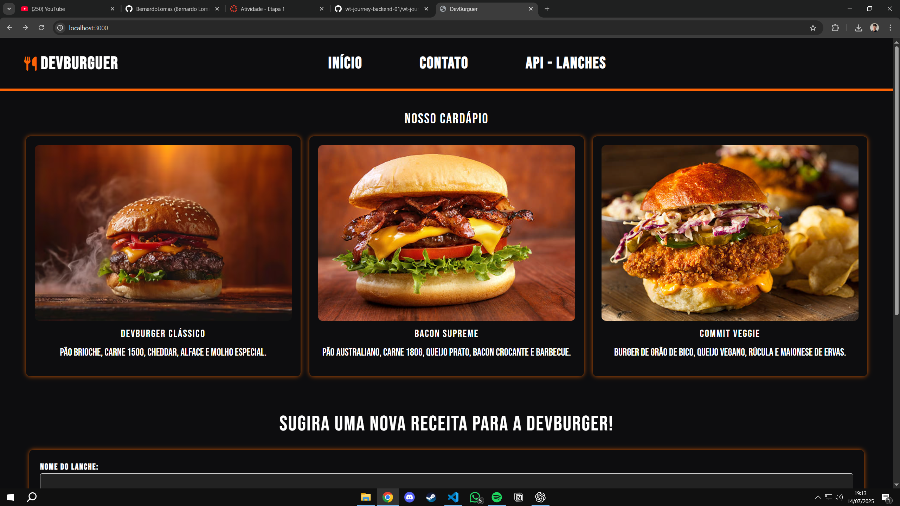
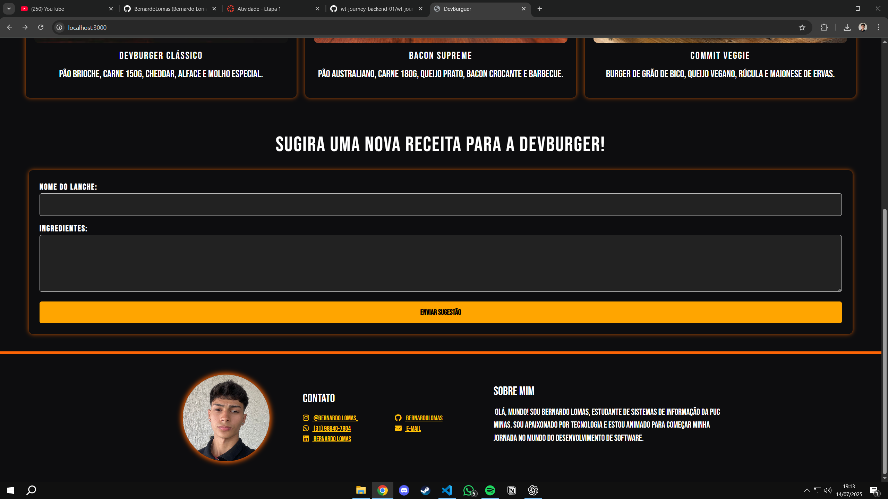
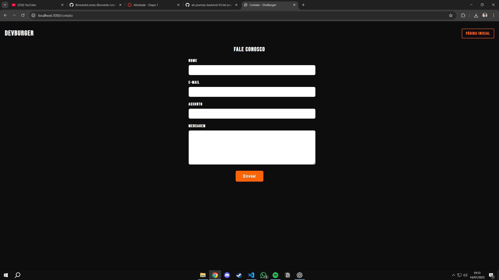

# 🍔 DevBurger - Cardápio Digital Gourmet

Projeto desenvolvido para a Atividade 1 da Etapa 1 do curso **Journey Backend**, promovido pela **WebTech Network** em parceria com a **LEVTY**, com foco em desenvolvimento de habilidades em Node.js e Express.

O **DevBurger** é um protótipo de cardápio digital para uma hamburgueria fictícia, onde os usuários podem visualizar os lanches disponíveis, enviar sugestões de novos sabores e entrar em contato com a equipe.

---

## 🚀 Como Rodar o Projeto

1. Clone este repositório:  
`git clone https://github.com/seu-usuario/devburger.git`

2. Instale as dependências:  
`npm install`

3. Inicie o servidor:  
`npm start`

4. Acesse no navegador:  
[http://localhost:3000](http://localhost:3000)

---

## 🌍 Rotas Disponíveis

- **`/`** (GET): Página principal com o cardápio e o formulário de sugestão  
- **`/sugestao`** (GET): Processa a sugestão e exibe uma página de agradecimento personalizada  
- **`/contato`** (GET): Página com formulário de contato  
- **`/contato`** (POST): Processa o contato e exibe os dados enviados  
- **`/contato-recebido`** (GET): Página acessada após redirecionamento do contato (PRG)  
- **`/api/lanches`** (GET): Retorna um JSON com os lanches cadastrados  
- **Qualquer outra rota**: Exibe uma página 404 customizada  

---

## 📝 Funcionalidades

✅ Visualização dos lanches disponíveis em cards estilizados  
✅ Envio de sugestões via formulário (GET)  
✅ Envio de mensagens via formulário de contato (POST)  
✅ Respostas personalizadas com os dados enviados  
✅ Rota de API simulada com dados em JSON  
✅ Página de erro 404 personalizada  
✅ Layout responsivo com HTML, CSS, Bootstrap e Font Awesome  

---

## 📷 Prints da Aplicação

### 🏠 Página Inicial  

### 🍔 Cardápio com Sugestões  

### 📬 Formulário de Contato  

---

## 👨‍💻 Autor

**Bernardo Lomas**  
Estudante de Sistemas de Informação - PUC Minas  
Apaixonado por tecnologia e desenvolvimento de software.

---

## 📚 Tecnologias Utilizadas

- Node.js  
- Express  
- HTML5 + CSS3  
- Bootstrap 5  
- Font Awesome  
- JSON
